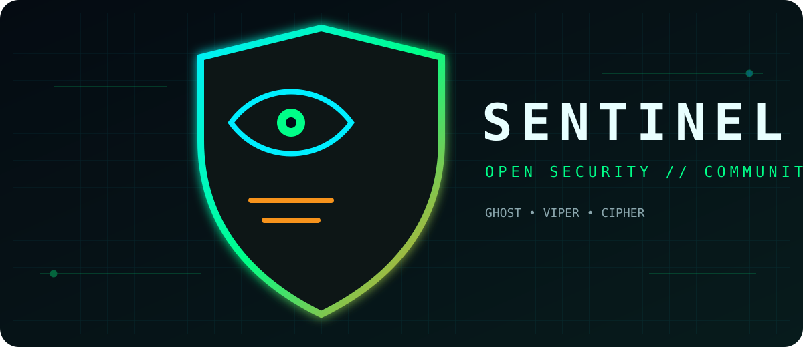

# Sentinel

<p align="center"></p>

<p align="center"><strong>Open security, community built.</strong><br/>A cyberpunk-inspired security panel for React applications.</p>

Sentinel combine une patrouille visuelle en temps réel, des compteurs de menaces et une vue d'activité réservée aux utilisateurs autorisés.

## Introduction

Sentinel donne une présence claire et compréhensible à la sécurité d’une application : trois agents — GHOST, VIPER et CIPHER — se relaient pour afficher l’état de la surveillance. Le composant reste volontairement modulaire afin que la communauté puisse l’adapter, l’améliorer et l’intégrer à ses propres outils.

## Fonctionnalités

- Agents de sécurité avec rotations horaires.
- Indicateurs de menaces fournis par l’application hôte.
- Télémétrie minimale et facultative, désactivée par défaut.
- Consentement séparé pour les catégories `security` et `analytics`.
- Vue PocketBase réservée aux utilisateurs autorisés.
- Composant React extensible par la communauté.

## Protection de la vie privée par défaut

`trackVisitor()` ne collecte et n'envoie aucune donnée tant que l'utilisateur n'a pas donné un consentement explicite à au moins une catégorie.

Exemple :

```js
setTrackingConsent({
  security: true,
  analytics: false,
});
```

Pour retirer les choix facultatifs :

```js
revokeTrackingConsent();
```

Un refus total signifie : **aucun appel de tracking vers PocketBase**.

Sentinel ne récupère plus dans son module de tracking standard :

- l'adresse IP publique ;
- la ville, la région ou les coordonnées géographiques ;
- le FAI ou l'organisation réseau ;
- le User-Agent complet ;
- le CPU, la RAM ou la liste des plugins ;
- la taille détaillée de l'écran ou de la fenêtre ;
- les paramètres d'URL ou le fragment (`#`) ;
- une empreinte persistante du navigateur.

La catégorie `security`, lorsqu'elle est acceptée, transmet uniquement un type d'appareil générique (`mobile`, `tablet` ou `desktop`).

La catégorie `analytics`, lorsqu'elle est acceptée, peut transmettre le chemin de la page, l'origine du référent et la langue du navigateur. Les paramètres d'URL et fragments sont volontairement exclus afin de limiter le risque de capturer accidentellement des jetons ou identifiants.

## Nom, prénom et adresse e-mail

Le refus du tracking **n'autorise pas Sentinel à récupérer automatiquement l'identité du visiteur**.

Le nom, le prénom ou l'adresse e-mail doivent provenir d'un traitement distinct : par exemple un formulaire de contact, une création de compte ou une inscription volontaire. L'application hôte doit expliquer la finalité de ce formulaire et ne collecter que les informations nécessaires.

Ces données de contact ne font pas partie de `sentinel-tracking.js`.

## Sécurité

Aucune clé de chiffrement ou clé API n'est requise par le module de tracking actuel et aucune clé secrète ne doit être placée dans le navigateur ou commitée dans Git.

L'application hôte doit imposer l'authentification et l'autorisation côté serveur. Masquer une vue dans React ne constitue pas un contrôle d'accès.

La collection PocketBase `visiteurs_sentinel` doit disposer de règles serveur strictes :

- création limitée aux champs attendus ;
- lecture réservée aux comptes/roles administratifs autorisés ;
- modification et suppression interdites aux visiteurs ;
- conservation limitée et purge régulière ;
- journaux ne contenant pas de secrets ni de données personnelles inutiles.

## RGPD et protection des données

Les garde-fous techniques de Sentinel facilitent la minimisation des données, mais ne constituent pas une certification de conformité.

Avant une mise en production, l'intégrateur doit notamment définir les finalités et bases légales applicables, fournir une information transparente, déterminer une durée de conservation, permettre l'exercice des droits applicables et vérifier la configuration de ses sous-traitants et services d'hébergement.

Lorsque le consentement est utilisé, le refus doit être aussi simple que l'acceptation et l'utilisateur doit pouvoir modifier son choix ultérieurement.

## Intégration

Importez les composants dans votre application React et adaptez l'import PocketBase à votre propre environnement. `Sentinel.jsx` référence également des modules propres à l'application hôte (`security.js` et `api/api-key-manager.js`) qui doivent être fournis ou remplacés lors de l'intégration.

Le module de suivi utilise par défaut une collection PocketBase nommée `visiteurs_sentinel`. Adaptez son schéma aux seuls champs réellement utilisés.

## Communauté

Les contributions sont les bienvenues. Forkez le projet, ouvrez une issue ou proposez une pull request. Décrivez clairement vos changements et ne publiez jamais de secrets, de données personnelles ou d'exports de production.

Toute contribution ajoutant une nouvelle collecte de données doit documenter sa finalité et rester désactivée par défaut lorsqu'elle n'est pas strictement nécessaire.

## Licence

Sentinel est distribué sous licence GNU GPL v3.0. Consultez le fichier `LICENSE`.
